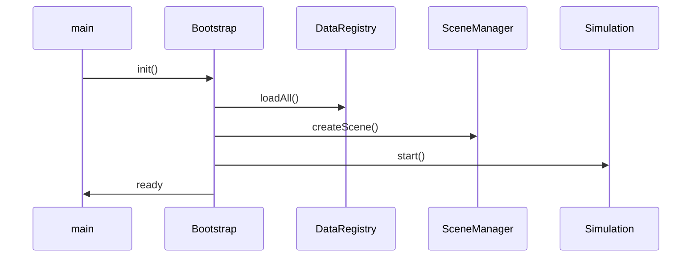

# System Architecture

## Principles

- Modular feature folders under `src/`
- Event-driven communication via `EventBus`
- Data-driven definitions in `public/data/*.json`
- No global singletons — services registered in `GameBootstrap`
- SOLID; composition over inheritance

## Module Map

```
src/
├── core/           GameBootstrap, EventBus, GameLoop, SaveSystem
├── data/           DataRegistry, schema types
├── presentation/   SceneManager, IsometricCamera, SpriteActor, Environment
├── simulation/     WorldClock, TickScheduler, NPCSimulator, EconomySimulator, WorldState
├── gameplay/       PlayerController, InteractionSystem, CombatManager, QuestManager, Inventory
└── ui/             HUD, DialoguePanel, CombatLog, PauseMenu
```

## Boot Sequence



## Event Flow (Examples)

| Event | Publisher | Subscribers |
|-------|-----------|-------------|
| `time:hour` | WorldClock | TickScheduler, NPCSimulator |
| `time:day` | WorldClock | EconomySimulator, QuestManager |
| `npc:moved` | NPCSimulator | Presentation (sprite update) |
| `price:changed` | EconomySimulator | UI, QuestManager |
| `quest:stage` | QuestManager | UI, WorldState |
| `combat:roll` | CombatManager | CombatLog UI |
| `world:flag` | WorldState | Dialogue, QuestManager |

## Data Ownership

| System | Owns | Reads |
|--------|------|-------|
| WorldState | Flags, reputation | — |
| NPCSimulator | NPC positions, schedule state | WorldClock, JSON npcs |
| EconomySimulator | Market prices | WorldClock, JSON goods |
| QuestManager | Active quest stages | WorldState, EventBus |
| CombatManager | Combat encounter state | JSON species, items |
| SaveSystem | Serialized snapshot | All `ISaveable` modules |

## Interfaces

```typescript
interface IGameModule {
  init(ctx: GameContext): void | Promise<void>;
  update(dt: number): void;
  dispose(): void;
}

interface ISaveable {
  saveKey: string;
  serialize(): unknown;
  deserialize(data: unknown): void;
}
```

## Future Expansion

- `ModLoader` reads `/mods/*/data/` and merges registries
- `NetworkModule` syncs WorldState deltas via WebSocket (Phase 12)
