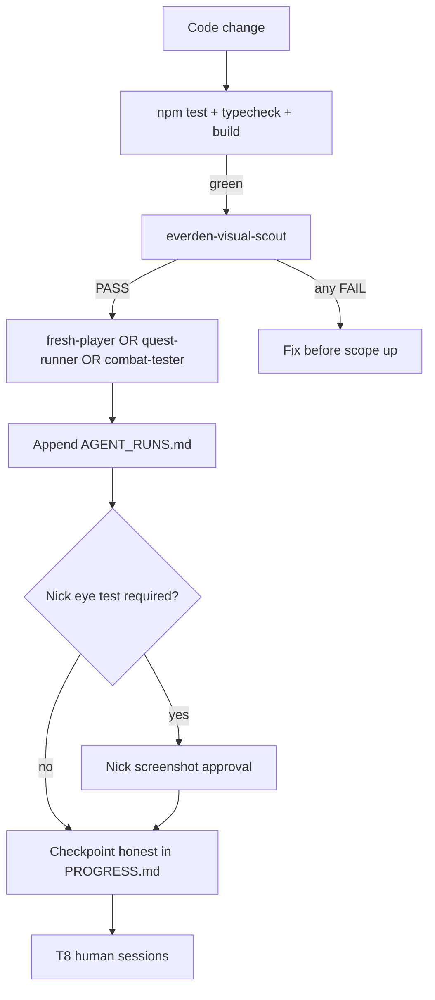

# Everden — Visual QA & Playtest Agents

**Problem:** Unit tests prove mechanics. They do **not** prove the game looks or plays like a game. Agents default to "69 tests green → ship it," which inflates Experience % and wastes Nick's time on broken builds.

**Solution:** A fixed agent roster, mandatory browser gates, screenshot rubrics, and a log file that is **not** human T8.

---

## Two tracks (never merge)

| Track | Who | Counts toward T8? | Counts toward Experience %? |
|-------|-----|-------------------|----------------------------|
| **Mechanical QA** | zenith (`npm test`) | No | Only if tests guard regressions |
| **Visual / play QA** | Agent personas below | No | Only after gate PASS + Nick eye test where required |
| **Human playtest** | Nick + external players | **Yes (T8)** | Yes, after 3/5 sessions pass PLAYTEST.md |

Agent runs go in [`docs/playtests/AGENT_RUNS.md`](../playtests/AGENT_RUNS.md).  
Human runs go in [`docs/playtests/SESSION_LOG.md`](../playtests/SESSION_LOG.md).

---

## Agent roster

Launch via Cursor **Task** tool. Each agent gets: dev URL, fresh-save steps, rows from PLAYTEST.md, and a required screenshot list.

### 1. `everden-visual-scout` (mandatory on every presentation/input change)

**When:** After edits to `src/engine/`, `src/presentation/`, `src/gameplay/PlayerController.ts`, `public/data/scenes/`, `GameBootstrap.ts`.

**Does:**
1. `npm run dev` (or use running port)
2. Clear `localStorage` key `everden_save_v1`
3. Start game → screenshot **each gate** below
4. Score each screenshot PASS / BORDERLINE / FAIL using rubric
5. Append one row to `AGENT_RUNS.md`

**Gate screenshots (minimum):**
| # | Scene | Action | File name pattern |
|---|-------|--------|-------------------|
| G1 | Causeway spawn | New game start | `gate-causeway-spawn.png` |
| G2 | Causeway | Click 3 different ground points (ring visible) | `gate-click-move.png` |
| G3 | Lilymarket | Walk/exit from causeway | `gate-lilymarket.png` |
| G4 | Lilymarket | Click Pip → dialogue open | `gate-pip-dialogue.png` |
| G5 | Any | District transition back to causeway | `gate-transition.png` |

**Rubric (FAIL = block Experience % bump):**

| Check | FAIL | BORDERLINE | PASS |
|-------|------|------------|------|
| Backdrop count | 2+ location arts visible | 1 art but misaligned | 1 art, reads as this district |
| NPC pile-up | More NPCs than scene JSON slots + player | Correct count but overlapping | ≤ scene NPC count, readable |
| Walk surface | Tiny slab floating in void | Slab + art disconnected | Ground reads walkable in-world |
| Click move | No movement on valid ground | Jittery path | Smooth path, ring at click |
| Exit discoverability | Cannot reach next district in 60s | Exits invisible but E works near label | Visible exit marker + label |
| Console | Any error | Warnings only | Clean |

**Does NOT:** Mark R3/R4 "Nick eye test" passed. That is Nick only.

---

### 2. `everden-fresh-player` (gamer persona — confusion test)

**When:** After R3+ scene work, UI changes, or new district.

**Persona prompt:** *"You've never seen this game. No devtools. No reading source. You have 5 minutes."*

**Script:**
1. Pick species at random
2. Enter world — can you tell where you are within 10s?
3. Find an NPC to talk to without pressing E first (click only)
4. Find how to leave the area
5. Note anything that feels like a debug sandbox

**Output:** Friction list + time-to-Pip + PASS/FAIL on "would I keep playing 5 more minutes?"

---

### 3. `everden-quest-runner` (PLAYTEST.md rows 4–10)

**When:** After quest, dialogue, scene, or save changes.

**Script:** Follow [`PLAYTEST.md`](../PLAYTEST.md) main + side quest rows in one session. Fresh save. Log each row pass/fail with screenshot on failure.

**Hard stops (P0 — fix before next feature):**
- Soft-lock in combat
- Save wipes active quest
- Dialogue condition wrong (quest-gated line missing)
- Examine doesn't advance objective

---

### 4. `everden-combat-tester` (PLAYTEST.md rows 11–14)

**When:** After `CombatManager`, encounters, abilities, or species changes.

**Script:** Mudwall → Blackfen → diplomacy buttons → one ability per species → flee fail/success → 3-enemy turn order (regression for CHECKIN-013).

**Output:** Combat log screenshot + PASS/FAIL per row.

---

### 5. `everden-district-explorer` (R5 gate)

**When:** After scene JSON or exit portal changes.

**Script:** Causeway → Lilymarket → Causeway → Croakend → Causeway → Mudwall → Causeway → Ferryman's Rest → Causeway. One screenshot per district. Note visual glitches on transition.

---

### 6. `nick-eye-test` (human only)

**When:** Composition milestones (Lilymarket first, then each new district art pass).

**Prompt for Nick:** Screenshot Lilymarket — does it read as **one market**? Yes/no. Agents cannot substitute.

---

## Session workflow (implementers)

**Rule:** No CHECKIN may claim Experience % increase on presentation work unless latest `AGENT_RUNS.md` entry is PASS and scout attached gate IDs.

---

## Routing table (which agent when)

| Change type | Unit tests | Scout | Persona agent | Nick |
|-------------|------------|-------|---------------|------|
| Engine/nav/pointer | ✅ | ✅ | fresh-player | if new scene |
| Scene JSON / loader | ✅ | ✅ | district-explorer | ✅ eye test |
| Quest/dialogue only | ✅ | — | quest-runner | — |
| Combat | ✅ | — | combat-tester | — |
| Art/assets | ✅ | ✅ | visual-scout + Nick | ✅ always |

---

## Why automation is weak (honest limits)

- WebGL screenshots in headless/automation miss depth and feel
- Scripted clicks ≠ human pointer accuracy
- Agents cannot judge "cozy" or "BG3-like" — only rubric FAIL/PASS
- **T8 remains humans only** for alpha gate

Use agents to **catch obvious failures before Nick opens the build**, not to replace Nick.

---

## Related files

- Skill: [`.cursor/skills/everden-playtest/SKILL.md`](../../.cursor/skills/everden-playtest/SKILL.md)
- Rule: [`.cursor/rules/everden-visual-gate.mdc`](../../.cursor/rules/everden-visual-gate.mdc)
- Log: [`docs/playtests/AGENT_RUNS.md`](../playtests/AGENT_RUNS.md)
- Human protocol: [`docs/PLAYTEST.md`](../PLAYTEST.md)
